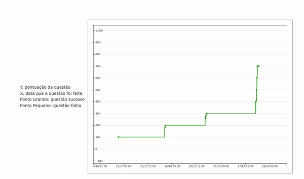

# WatchTKO



## TODO

- desacoplar código criando funções e classes;
- conseguir criar múltiplas linhas;
- conseguir ler múltiplos arquivos de histórico.
- criar uma classe só para processar os dados do `./history` adicionando no topo do texto `hash,date,type,command,value`;
  - validar o hash
- ultilizar a API do github para coletar os dados de nome e foto;
- melhorar a interface gráfica;
- otimizar o código com cache;
- criar filtros;
- criar uma segunda visualização do código usando o `.tko/daily.json`

## Como testar?

Coloque o `.tko` na pasta `./scripts/data/{nick-do-github}`

Adicione os dados do aluno no arquivo `data.json`.
```json
{
    "name": "Clarice Mais da Silva",
    "nick": "nick3",
    "avatar": ""
}
```

Ainda preciso automatizar isso com outro script porque o JavaScript no Browser não tem acesso aos arquivos do sistema.

## Como eu gostaria de estruturar os arquivos

- data
  - nome-de-usuario 
    - .tko
      - history.csv
      - daily.json
  - nome-de-usuario
    - .tko
      - history.csv
      - daily.json
- index.html
- styles
  - ... TODO 
- scripts
  - ... TODO
