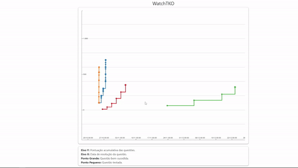

# WatchTKO



## TODO

- desacoplar código criando funções e classes;
  - validar o hash
- criar filtros;
- ultilizar a API do github para coletar os dados de nome e foto;
- melhorar a interface gráfica;
- otimizar o código com cache;

- criar uma segunda visualização do código usando o `.tko/daily.json`;
- gerar gráficos de área empilhada;
- automatizar coleta e processamento de dados;
- tentar colocar o link do arquivo do github exato do codigo que a pessoa fez usando o `.track`;

## Como testar?

Coloque o `.tko` na pasta `./scripts/data/{nick-do-github}`

Adicione os dados do aluno no arquivo `data.json`.
```json
{
    "name": "Clarice Mais da Silva",
    "nick": "nick3",
    "avatar": ""
}
```
